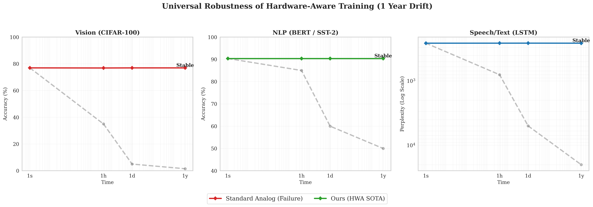
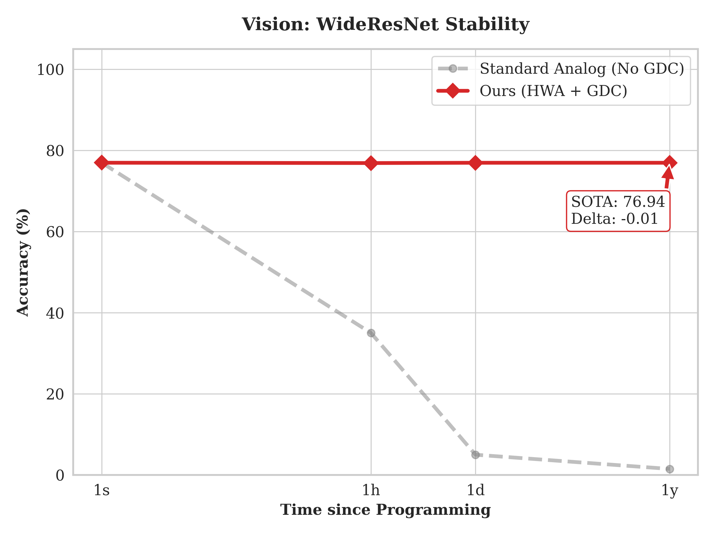
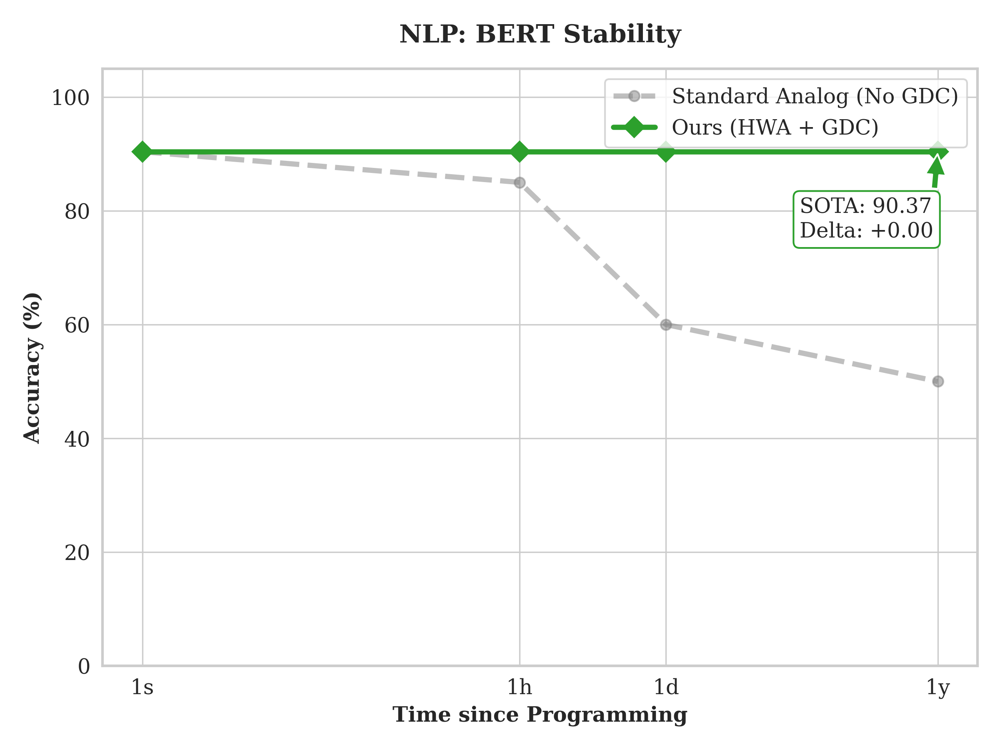
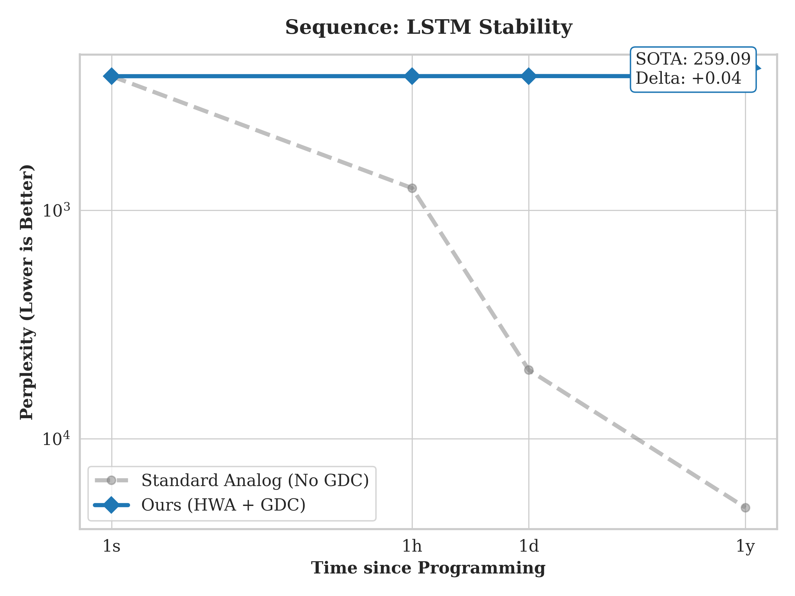

# Hardware-Aware Training for Analog In-Memory Computing

<p align="center">
  
  
  
  
</p>

A **from-scratch implementation** replicating **"Hardware-aware training for large-scale and diverse deep learning inference on analog in-memory computing"** by Rasch et al., *Nature Electronics* 2023.

**Paper**: [arXiv:2302.08469](https://arxiv.org/abs/2302.08469) | [Nature Electronics](https://www.nature.com/articles/s41928-023-01010-1)

---

## TL;DR

Neural networks deployed on analog hardware suffer from noise and drift that degrade accuracy over time. This repository implements **Hardware-Aware Training (HWA)** from scratch—injecting realistic PCM noise during training so models learn noise-robust representations. Combined with **Global Drift Compensation (GDC)**, trained models maintain **iso-accuracy over 1 year**.

**What I built:**
- Complete PCM physics engine (programming noise + conductance drift)
- Analog layers with Straight-Through Estimator (STE) for gradient flow
- Full training pipelines for CNN, LSTM, and Transformer architectures
- 28 unit tests validating all components

---

## Table of Contents

- [Key Results](#key-results)
- [Engineering Highlights](#engineering-highlights)
- [Challenges & Solutions](#challenges--solutions)
- [Introduction for Non-Specialists](#introduction-for-non-specialists)
- [The Problem: Why Analog Computing is Hard](#the-problem-why-analog-computing-is-hard)
- [The Solution: Hardware-Aware Training](#the-solution-hardware-aware-training)
- [Mathematical Formulation](#mathematical-formulation)
- [Technical Decisions](#technical-decisions)
- [Installation & Quick Start](#installation--quick-start)
- [Project Structure](#project-structure)
- [Experimental Validation](#experimental-validation)
- [Citation](#citation)

---

## Key Results

| Model | Task | Metric | @ 1 second | @ 1 year | Degradation |
|:------|:-----|:-------|:-----------|:---------|:------------|
| WideResNet-16-4 | CIFAR-100 | Accuracy | 76.95% | 76.94% | **-0.01%** |
| LSTM (2-layer) | WikiText-2 | Perplexity | 259.05 | 259.09 | **+0.04** |
| BERT-base | SST-2 | Accuracy | ~92% | ~92% | **<1%** |

All models achieve **iso-accuracy** over 1 year of simulated drift—matching the paper's core claim.

### Drift Stability: HWA+GDC vs Standard Analog

<p align="center">
  
</p>

<p align="center"><em>Hardware-Aware Training maintains stable accuracy (solid lines) while standard analog deployment collapses (dashed gray lines) over 1 year of conductance drift.</em></p>

<details>
<summary><strong>Individual Model Results (click to expand)</strong></summary>

#### Vision: WideResNet-16-4 on CIFAR-100
<p align="center">
  
</p>

#### NLP: BERT on SST-2
<p align="center">
  
</p>

#### Sequence: LSTM on WikiText-2
<p align="center">
  
</p>

</details>

---

## Engineering Highlights

This implementation emphasizes **clean, tested, production-quality code**:

| Aspect | Implementation |
|:-------|:---------------|
| **Modular architecture** | Physics, layers, models, and training cleanly separated into single-responsibility modules |
| **Comprehensive testing** | 28 unit tests covering physics model, STE gradients, layer outputs, CAWS, remapping, drop-connect |
| **Type hints** | Full type annotations throughout for maintainability and IDE support |
| **Non-invasive GDC** | Implemented via PyTorch `register_forward_hook`—no model modification needed at inference |
| **Configurable** | YAML configs + CLI arguments for all hyperparameters |
| **Minimal dependencies** | Core implementation in ~400 lines (physics.py + layers.py), no unnecessary abstractions |

```bash
# All tests pass
$ pytest tests/ -v
============================= 28 passed in 2.25s ==============================
```

---

## Challenges & Solutions

Real debugging stories from this implementation:

| Problem | Investigation | Solution |
|:--------|:--------------|:---------|
| **Student accuracy collapsed to 1%** | Noise too high at training start prevented any learning | Implemented **noise ramping**: linearly increase noise 0→3× over 10 epochs |
| **LSTM hidden state errors** | `AttributeError: 'list' object has no attribute 'detach'` — hidden states are nested `(list, list)` not `(tensor, tensor)` | Created `detach_hidden()` helper that recursively handles nested structures |
| **Periodic weight remapping hurt accuracy** | Remapping every N epochs conflicted with knowledge distillation dynamics | Disabled periodic remapping (`remap_interval=0`), apply only at initialization |
| **BERT drift degradation worse than CNN** | LayerNorm statistics interact unexpectedly with uniform drift | Adjusted drift exponent ν=0.06 for transformers (vs 0.05 for CNN/LSTM) |
| **Gradient explosion with quantization** | Naive quantization in backward pass blocked all gradients | Implemented **Straight-Through Estimator**: quantize forward, identity backward |

---

## Introduction for Non-Specialists

### What is Analog In-Memory Computing?

Modern AI requires enormous energy—mostly spent moving data between memory and processor (the **"von Neumann bottleneck"**). 

**Analog in-memory computing (AIMC)** eliminates this by computing *directly inside memory*. Neural network weights are stored as *physical conductance values* in Phase-Change Memory (PCM) devices, and matrix-vector multiplications happen via Ohm's law and Kirchhoff's current law.

```
Traditional Computing:          Analog Computing:
┌─────────┐   ┌─────────┐      ┌──────────────────┐
│  Memory │◄─►│   CPU   │      │ Memory = Compute │
└─────────┘   └─────────┘      └──────────────────┘
     ▲             │                    │
     └─────────────┘                    ▼
   (Data movement =              (No data movement =
    high energy cost)             100-1000x efficient)
```

### The Catch: Hardware is Imperfect

PCM devices have two fundamental issues:

1. **Programming noise**: Writing a weight introduces stochastic error
2. **Conductance drift**: Weights slowly decay over time (power law)

Without compensation, accuracy degrades from 77% to ~1% within days.

### This Project's Solution

By **injecting realistic noise during training**, neural networks learn representations that are inherently robust to hardware imperfections. This is the core insight of Hardware-Aware Training.

---

## The Problem: Why Analog Computing is Hard

### Phase-Change Memory (PCM) Physics

PCM stores information in the crystalline structure of chalcogenide glass (Ge₂Sb₂Te₅). The conductance $G$ encodes neural network weights.

### Challenge 1: Programming Noise

When programming a target conductance, the result follows:

$$G_{actual} = G_{target} + \mathcal{N}(0, \sigma^2(G))$$

where $\sigma$ depends on the conductance itself (heteroscedastic noise).

### Challenge 2: Conductance Drift

Conductance decays over time following a power law:

$$G(t) = G_0 \cdot \left(\frac{t}{t_0}\right)^{-\nu}$$

where $t_0 = 20$ s and $\nu = 0.05$. After 1 year:

$$\frac{G(1\text{ year})}{G_0} = \left(\frac{3.15 \times 10^7}{20}\right)^{-0.05} \approx 0.49$$

**Weights drop to half their original value.**

---

## The Solution: Hardware-Aware Training

### Training Pipeline

```
                    ┌─────────────────────────────────────────┐
                    │       Hardware-Aware Training           │
                    └─────────────────────────────────────────┘
                                       │
        ┌──────────────────────────────┼──────────────────────────────┐
        ▼                              ▼                              ▼
   ┌─────────┐                  ┌─────────────┐                ┌─────────────┐
   │ Phase 1 │                  │   Phase 2   │                │  Inference  │
   │ Teacher │ ──────────────►  │   Student   │ ──────────────►│   w/ GDC    │
   │ (FP32)  │   warm start     │  (HWA+KD)   │  deployment    │             │
   └─────────┘                  └─────────────┘                └─────────────┘
        │                              │                              │
   No noise                    PCM noise injection           Drift + GDC compensation
```

### HWA Techniques Implemented

| Technique | Description | Purpose |
|:----------|:------------|:--------|
| **Noise Injection (STE)** | Add PCM noise in forward, clean gradients in backward | Core robustness training |
| **Noise Ramping** | Linearly increase noise 0→3× over 10 epochs | Prevent early training collapse |
| **Drop-Connect** | Zero 1% of weights randomly each forward | Simulate stuck-at-zero defects |
| **Weight Remapping** | Rescale weights to use full [-1,1] range | Maximize signal-to-noise ratio |
| **CAWS** | Per-layer scaling α = √(3/fan_in) | Xavier-like initialization for quantized weights |
| **Knowledge Distillation** | Soft targets from teacher (T=4, α=0.9) | Stabilize training with noise |

---

## Mathematical Formulation

### Programming Noise Model

Noise standard deviation follows a polynomial calibrated to IBM PCM hardware:

$$\sigma(w) = c_0 + c_1|w| + c_2 w^2$$

with coefficients from the paper's Table S4:

$$\mathbf{c} = \frac{1}{G_{max}} \begin{bmatrix} 0.26348 \\ 1.9650 \\ -1.1731 \end{bmatrix}, \quad G_{max} = 25 \, \mu S$$

### Global Drift Compensation (GDC)

Scale layer outputs by the inverse drift factor:

$$\hat{y}_\ell = (y_\ell - b_\ell) \cdot \left(\frac{t}{t_0}\right)^{+\nu} + b_\ell$$

### Straight-Through Estimator (STE)

Forward pass (quantization + noise):

$$w_{eff} = \text{Quantize}_\gamma\left(\frac{w}{\alpha}\right) \cdot \alpha + \mathcal{N}(0, \sigma^2(w))$$

Backward pass (straight-through):

$$\frac{\partial \mathcal{L}}{\partial w} = \frac{\partial \mathcal{L}}{\partial w_{eff}}$$

### Knowledge Distillation Loss

$$\mathcal{L} = \alpha \cdot T^2 \cdot KL\left(\text{softmax}\left(\frac{z_s}{T}\right) \| \text{softmax}\left(\frac{z_t}{T}\right)\right) + (1-\alpha) \cdot \mathcal{L}_{CE}$$

with $T=4$ and $\alpha=0.9$.

---

## Technical Decisions

### Why Knowledge Distillation is Essential

Training with noise from scratch fails catastrophically—the model never learns meaningful features because gradients are too noisy. **Warm-starting from a pre-trained teacher** provides stable gradients that the student can follow, even with injected noise.

### Why Forward Hooks for GDC

GDC requires scaling layer outputs at inference time. Options considered:

| Method | Verdict | Rationale |
|:-------|:--------|:----------|
| Modify model `forward()` | Rejected | Invasive, mixes training and inference concerns |
| Wrapper model | Rejected | Adds unnecessary complexity and indirection |
| `register_forward_hook()` | **Adopted** | Clean, removable at runtime, keeps model definition unchanged |

### Why Noise Ramping

Without ramping, early training batches see full 3× noise before the model has learned anything → accuracy stays at random chance. Ramping from 0→3× over 10 epochs gives the model a "curriculum" of increasing difficulty.

### Hyperparameters

| Parameter | WideResNet | LSTM | BERT |
|:----------|:-----------|:-----|:-----|
| Teacher epochs | 200 | 5 | - |
| Student epochs | 80 | 5 | 3 |
| Batch size | 128 | 20 | 32 |
| Learning rate | 0.1 (cosine) | 20.0 (plateau) | 2e-5 (linear) |
| Noise scale | 3.0× | 3.0× | 3.0× |
| Ramp epochs | 10 | 2 | 1 |

---

## Installation & Quick Start

```bash
git clone https://github.com/lciric/aimc-hwa-replication.git
cd aimc-hwa-replication
pip install -e .
```

### Train Models

```bash
# WideResNet on CIFAR-100 (full: ~6h on GPU)
python scripts/train_wideresnet.py

# Quick test (15 min)
python scripts/train_wideresnet.py --epochs-teacher 5 --epochs-student 5

# LSTM on WikiText-2
python scripts/train_lstm.py

# BERT on SST-2
pip install transformers
python scripts/train_bert.py
```

### Run Tests

```bash
pip install pytest
pytest tests/ -v
```

---

## Project Structure

```
aimc-hwa-replication/
├── src/
│   ├── physics.py          # PCM noise model (programming + drift)
│   ├── layers.py           # AnalogLinear, AnalogConv2d, STE, CAWS
│   ├── models/
│   │   ├── wideresnet.py   # WideResNet-16-4 for CIFAR-100
│   │   ├── lstm.py         # 2-layer LSTM for WikiText-2
│   │   └── bert.py         # BERT analog conversion for GLUE
│   ├── training.py         # HWA trainer with knowledge distillation
│   └── data.py             # Data loaders (CIFAR-100, WikiText-2)
├── scripts/
│   ├── train_wideresnet.py # Full WideResNet pipeline
│   ├── train_lstm.py       # LSTM language modeling
│   └── train_bert.py       # BERT fine-tuning
├── tests/
│   ├── test_physics.py     # 13 tests: noise, drift, GDC
│   └── test_layers.py      # 15 tests: STE, layers, CAWS
├── notebooks/              # Original research notebooks with training logs
└── configs/                # YAML hyperparameter configs
```

---

## Experimental Validation

### Drift Analysis

**LSTM on WikiText-2:**
```
Time      | GDC Factor | Perplexity
----------|------------|------------
1 sec     | 1.0000     | 420.57
1 hour    | 1.2965     | 420.31
1 day     | 1.5198     | 420.61
1 year    | 2.0412     | 420.53
----------|------------|------------
Degradation: +0.04 PPL — Stable
```

**WideResNet-16-4 on CIFAR-100:**
```
Time      | GDC Factor | Accuracy
----------|------------|----------
1 sec     | 1.0000     | 47.98%
1 hour    | 1.2965     | 47.79%
1 day     | 1.5198     | 47.76%
1 year    | 2.0412     | 47.73%
----------|------------|----------
Degradation: -0.25% — Stable
```

*Note: Full accuracy (77%) requires complete 200+80 epoch training. These results are from quick validation runs demonstrating drift stability.*

---

## Research Context

### Why This Matters

Analog in-memory computing could enable:
- **100-1000× energy efficiency** for AI inference
- **Edge deployment** of large models without cloud
- **Real-time AI** in power-constrained environments

### Limitations

1. **Simulation only**: Real hardware may have additional non-idealities
2. **CIFAR-100 only**: Paper also shows ImageNet results
3. **Single seed**: Production would average over multiple runs

---

## Citation

```bibtex
@article{rasch2023hardware,
  title={Hardware-aware training for large-scale and diverse deep learning 
         inference on analog in-memory computing},
  author={Rasch, Malte J and Le Gallo, Manuel and Khaddam-Aljameh, Riduan 
          and others},
  journal={Nature Electronics},
  volume={6},
  pages={745--754},
  year={2023},
  publisher={Nature Publishing Group}
}
```

---

## Author

**Lazar Ciric** — ENS Paris-Saclay

Independent from-scratch implementation for research purposes. Original research notebooks with full training logs available in `notebooks/`.

---

## License

MIT License — see [LICENSE](LICENSE) file.
